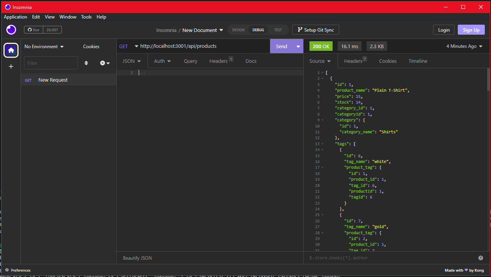

# Market_Stock-API

## Description
this app lets you create and manage a stock inventory with categories and tags to help manage and organize your stocked shelves

## Installation
bring the files into your computer and open the file via git bash then run "npm i" and "npm run seed" then finally run "node server.js"

## Usage
for the best experience in using this app you will need insomnia (both kinds) there are 3 main route types all route types have the same functions called by adding the following after the routes setting the method and occasionally sending an object in the shown format shown also images will be added to show what the basic get looks like 

- the required methods will be in (method)
- places you fill in will be notated by --(type)-- 
- non required lines are marked by *italics*

### formatless:

- get all: (get) / 

- get by id: (get) /--id--

- delete:(delete) /--id--

### formats imgs and methods by type:

#### products: http://localhost:3001/api/products

- post: (post) /  
    {  
      *product_name: "--name--"*,  
      *price: --decimal--*,  
      *stock: --num--*,  
      *tagIds: [--tags seaperated by commas--]*   
    }  

- put: (put) /--id--  
    {  
      *product_name: "--name--"*,  
      *price: --decimal--*,  
      *stock: --num--*,  
      *tagIds: [--tags seaperated by commas--]*   
    }  
    

#### categories: http://localhost:3001/api/categories

- post: (post) /  
 {  
   *"id":--num--,*  
   "category_name":"--name--"  
 }

- put: (put) /--id--  
{"category_name":"--name--"}

#### tags: http://localhost:3001/api/tags

- post: (post) /  
 {  
   *"id":--num--,*  
   "tag_name":"--name--"  
 }  
 
- put: (put) /--id--    
{"tag_name":"--name--"}

## Links
tutorial https://youtu.be/ktS9pmK2k2o
